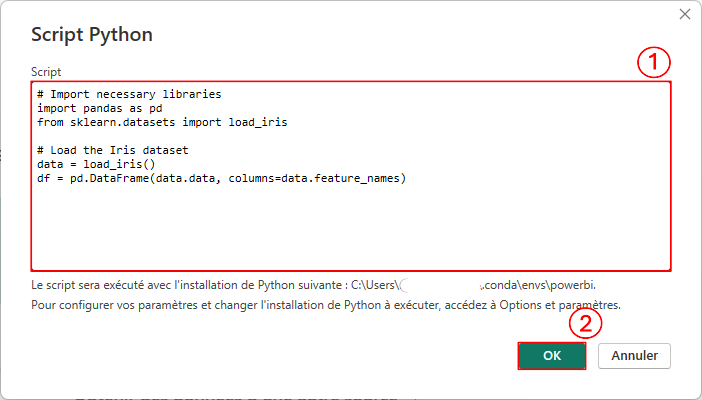

# Power BI : du Machine Learning avec scikit-learn

L'intégration de scikit-learn dans Power BI offre la possibilité d'enrichir les rapports avec des capacités de machine learning avancées. Cette article vise à montrer comment implémenter efficacement une méthode de machine learning dans un rapport Power BI.

## Prérequis

- Power BI installé

- Python installé sur votre machine (avec les librairies pandas et scikit-learn) de préférence dans un environnement Conda

- Option Python activée dans Power BI [voir mon article sur le sujet](https://github.com/NajibMAHJOUBI/PowerBI-Anaconda.git)

Ce dépôt GitHub reprend l'ensemble des éléments présentés dans cet article.

## Chargement des données dans Power BI

Power BI offre de multiple connecteurs permettant d'ingérer des données dans un modèle sémantique. Toutefois pour des raisons de simplicité pour cet article, nous allons utiliser Python comme une source de données en écrivant un script pour importer des données. Voici un script pour charger le jeu de données Iris depuis la librairie pandas : 

```python
# Import necessary libraries
import pandas as pd
from sklearn.datasets import load_iris

# Load the Iris dataset
data = load_iris()
df = pd.DataFrame(data.data, columns=data.feature_names)
```

Commencer par lancer Power BI Desktop, puis ouvrir un Rapport vierge. Depuis le volet **Données**, cliquer sur **Obtenir les données > Plus**, ce qui va ouvrir la fenêtre **Obtenir les données** :

1. Depuis le volet gauche, cliquer sur 

2. Choisir l'option **Script Python**

3. Enfin, cliquer sur le bouton **Se connecter**


Cela va ouvrir la fenêtre **Script Python** dans laquelle :

Copier-coller le code Python dans le champ Script 
Cliquer sur OK se qui va lancer l'exécution du code Python




Après exécution sans erreur de ce script Python, la fenêtre **Navigateur** va vous permettre de sélectionner les dataframe à inclure dans votre modèle sémantique :

1. Depuis le volet gauche, choisir le dataframe Pandas df créé dans le script Python 

2. Cliquer sur le bouton **Charger** pour inclure le dataframe dans le modèle sémantique


## Clustering k-Means dans Power BI avec Python
Pour cet article, nous allons mettre en place un clustering de type k-means en utilisant la librairie Python scikit-learn. Pour cela, nous proposons d'utiliser le code Python qui doit créer trois clusters des données de la façon suivante :

```python
import pandas as pd
from sklearn.cluster import KMeans
from sklearn.preprocessing import StandardScaler

# Standardisation of the dataset
scaler = StandardScaler()
scaled_features = scaler.fit_transform(dataset)

# Convert the scaled array back to a DataFrame with original column names
scaled_df = pd.DataFrame(scaled_features, columns=dataset.columns)

#  Clustering with KMeans
kmeans = KMeans(n_clusters=3, random_state=42)
kmeans.fit(scaled_features)

#Predict clusters and add to DataFrame
dataset["clusters"] = kmeans.predict(scaled_df)

# Delete scaled_df as it is no longer needed
del scaled_df
```

Une fois revenu dans l'**Affichage du rapport**, sélectionner depuis le menu **Transformer les données > Transformer les données**, ce qui va ouvrir l'éditeur Power Query. Ensuite, suivre les étapes suivantes : 

1- Aller dans le menu **Transformer**
2. Cliquer sur **Exécuter le script Python**:


Une fois la fenêtre **Exécuter le script Python** ouverte,

1. Copier-coller le [code Python](python/clustering_kmeans.py) dans le champ Script

2. Puis cliquer sur OK pour lancer l'exécution du code 


Après l'exécution sans erreur du code Python, Power BI propose de télécharger les tables créées dans le script : 

1. Développer la colonne **Value** 

2. Sélectionner les colonnes à inclure dans la requête. En plus des colonnes initialement présentent dans le jeu de données, vous allez également sélectionner la colonne Cluster créée dans le script Python

3. Décocher la case **Utiliser le nom de la colonne d'origine comme préfixe**

4. Cliquer le bouton **OK**


Une fois la table chargée, vous pouvez :

1. Développer la colonne cluster pour constater que les données sont bien regroupées en trois clusters comme attendu. 

2. Cliquer sur **OK** pour fermer cet aperçu 

3. Puis enfin cliquer sur **Fermer & appliquer** pour fermer l'éditeur Power Query.

## Avantages et Inconvénients

### Avantages 

1. **Accès à des algorithmes puissants**. L'utilisation de scikit-learn offre une large gamme d'algorithmes (régression, classification, NLP, etc.) bien au-delà des fonctions natives de Power BI. 

2. **Flexibilité et personnalisation**. Contrairement aux outils intégrés de Power BI, l'utilisation de scikit-learn permet d'ajuster finement les hyperparamètres, d'appliquer des traitements complexes ou encore d'utiliser des pipelines de traitement. 

3. **Intégration transparente avec Python**. Power BI permet d'exécuter des scripts Python directement dans les requêtes ou les visuels sans avoir besoin de déployer un modèle externe. 

4. **Visualisation des résultats dans Power BI**. Les résultats (cluster ou prédiction) peuvent être exploités dans des Dashboard interactifs. 

### Inconvénients

1. **Limitations de performance**. Power BI n'est pas optimisé pour le Machine Learning intensif. En effet Python peut être lent sur de gros datasets et ne propose pas de parallélisation native (contrairement à Spark ou Dask)

2. **Dépendance à Python**. Tous les utilisateurs doivent avoir Python installé avec les bonnes librairies et les bonnes versions pour éviter les problèmes de compatibilité.

## Conclusion 
L'intégration de scikit-learn et Power BI permet de créer des rapports prédictifs puissants. En résumé, scikit-learn dans Power BI est un outil puissant mais à utiliser avec discernement en ayant conscience des avantages de ce type d'approche et de ses limitations. 
