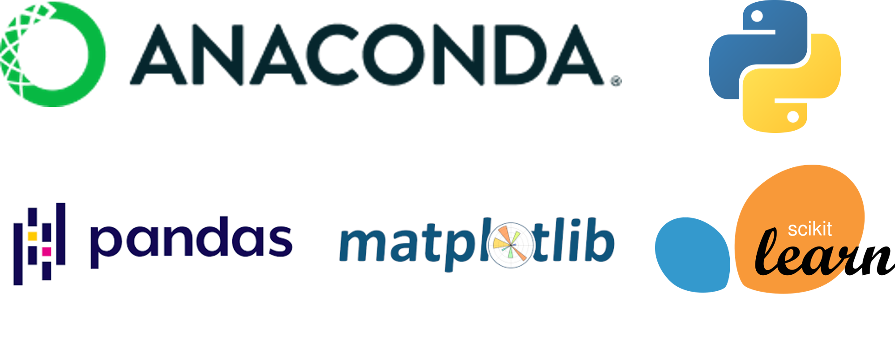
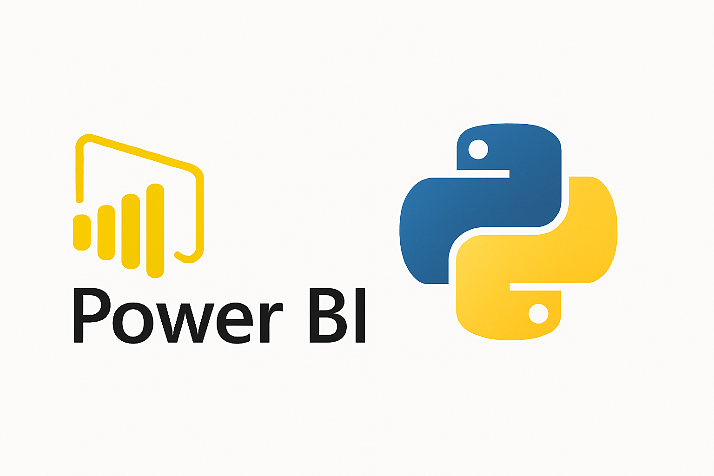
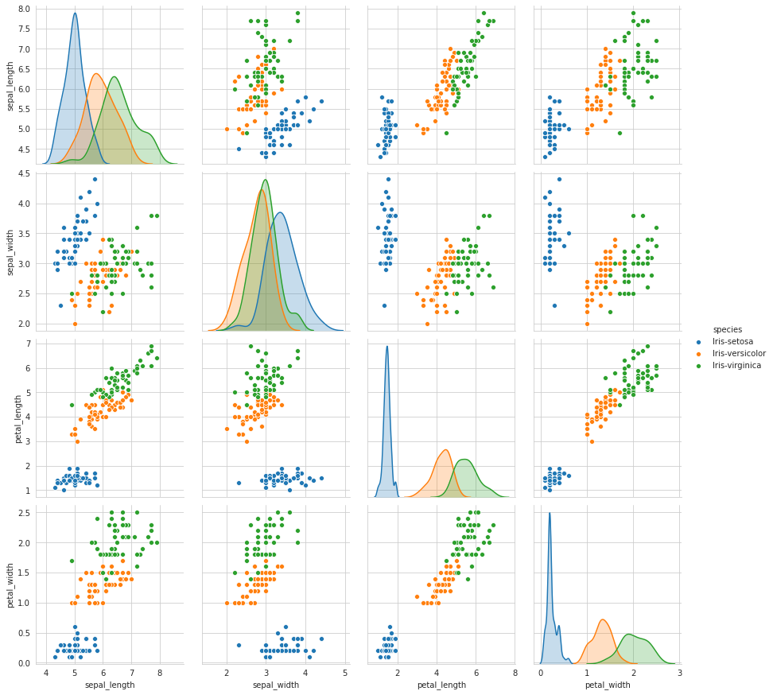

# Machine Learning avec scikit-learn dans Power BI

---

## Installation environnement Python 

- Pandas
- Matplotlib
- Scikit-Learn

---

## Configuration Power BI pour utiliser Python

- Pandas
- Matplotlib
- Scikit-Learn

---
 
## Chargement des données dans Power BI

- Jeu de données Iris
- Source de données : Python

---

## Clustering k-Means dans Power BI avec Python

- Scikit-Learn